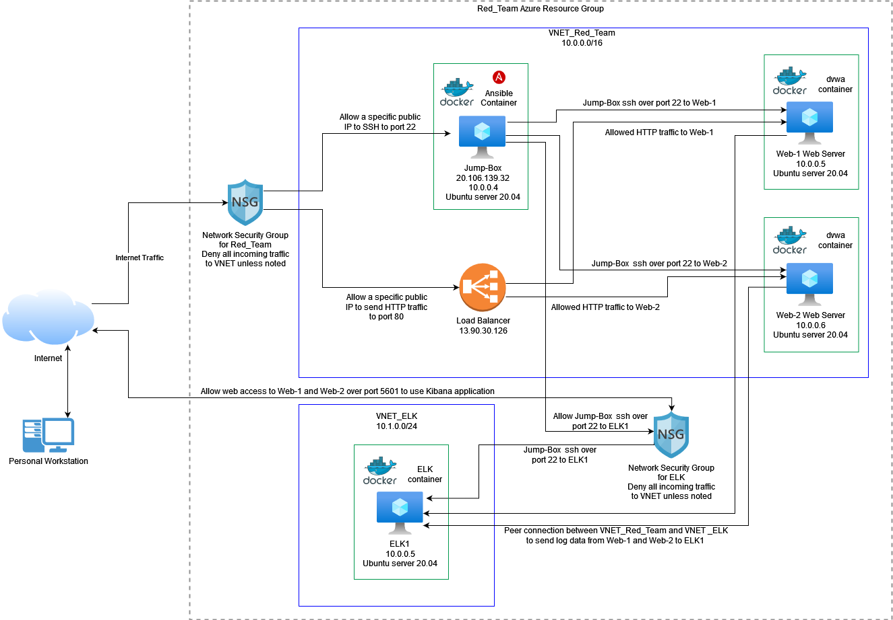
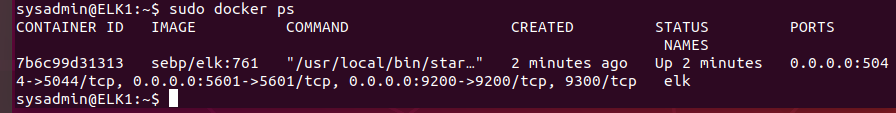

# UCSD_Bootcamp_Project1
Files for UCSD Cybersecurity Bootcamp Project 1 cloud network and monitoring.

## Automated ELK Stack Deployment

The files in this repository were used to configure the network depicted below.

These files have been tested and used to generate a live ELK deployment on Azure. They can be used to either recreate the entire deployment pictured above. Alternatively, select portions of the _____ file may be used to install only certain pieces of it, such as Filebeat.

This document contains the following details:
- Description of the Topology
- Access Policies
- ELK Configuration
  - Beats in Use
  - Machines Being Monitored
- How to Use the Ansible Build

### Description of the Topology

The main purpose of this network is to expose a load-balanced and monitored instance of DVWA, the Damn Vulnerable Web Application.

Load balancing ensures that the application will be highly resilient, in addition to restricting traffic to the network.
- A load balancer helps to mitigate denial of service attacks by evenly distributing
- Using the jump box creates a more secure architecture. Traffic must be forwarded to the jump box which forwards to the web servers rather than allowing public traffic straight to web servers. The jump box is set up with access controls to ensure only authorized access occurs. This also reduces the attack surface of the network.

Integrating an ELK server allows users to easily monitor the vulnerable VMs for changes to the user and system files.
- Filebeat collects data about the file system.
- Metricbeat collects data about machine metrics, such as uptime or CPU usage.

The configuration details of each machine may be found below.

| Name     | Function   | IP Address | Operating System    |
|----------|------------|------------|---------------------|
| Jump Box | Gateway    | 10.0.0.4   | Ubuntu Server 20.04 |
| Web-1    | Web Server | 10.0.0.5   | Ubuntu Server 20.04 |
| Web-2    | Web Server | 10.0.0.6   | Ubuntu Server 20.04 |
| ELK1     | ELK Stack  | 10.1.0.5   | Ubuntu Server 20.04 |

### Access Policies

The machines on the internal network are not exposed to the public Internet. 

Only the Jump Box machine can accept connections from the Internet. Access to this machine is only allowed from the administrator's IP addresses.
- Note the public IP used to configure these machines is not shown for privacy.

Machines within the network can only be accessed by the Ansible container on the Jump Box machine.
- The Jump Box machine (10.0.0.4) accesses the other machines from the Ansible container via ssh.

A summary of the access policies in place can be found in the table below.

| Name     | Publicly Accessible | Allowed IP Addresses |
|----------|---------------------|----------------------|
| Jump Box | Yes                 | Admin public IP      |
| Web-1    | No                  | 10.0.0.4             |
| Web-2    | No                  | 10.0.0.4             |
| ELK1     | Yes                 | 10.0.0.4             |

### Elk Configuration

Ansible was used to automate configuration of the ELK machine. No configuration was performed manually, which is advantageous because multiple machines could be configured at the same time. The Ansible playbook file contains the information needed to configure multiple machines in a network simultaneously.

The playbook implements the following tasks:
- Configure target VM to use more memory
- Install docker.io
- Install python3-pip
- Install docker pip package
- Download ELK container
- Enable docker service to run on boot

The following screenshot displays the result of running `docker ps` after successfully configuring the ELK instance.

### Target Machines & Beats
This ELK server is configured to monitor the following machines:
- 10.0.0.5
- 10.0.0.6

We have installed the following Beats on these machines:
- Filebeat
- Metricbeat

These Beats allow us to collect the following information from each machine:
- _TODO: In 1-2 sentences, explain what kind of data each beat collects, and provide 1 example of what you expect to see. E.g., `Winlogbeat` collects Windows logs, which we use to track user logon events, etc._

### Using the Playbook
In order to use the playbook, you will need to have an Ansible control node already configured. Assuming you have such a control node provisioned: 

SSH into the control node and follow the steps below:
- Copy the _____ file to _____.
- Update the _____ file to include...
- Run the playbook, and navigate to ____ to check that the installation worked as expected.

_TODO: Answer the following questions to fill in the blanks:_
- _Which file is the playbook? Where do you copy it?_
- _Which file do you update to make Ansible run the playbook on a specific machine? How do I specify which machine to install the ELK server on versus which to install Filebeat on?_
- _Which URL do you navigate to in order to check that the ELK server is running?

_As a **Bonus**, provide the specific commands the user will need to run to download the playbook, update the files, etc._
